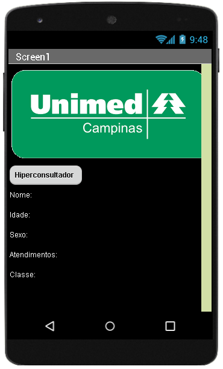
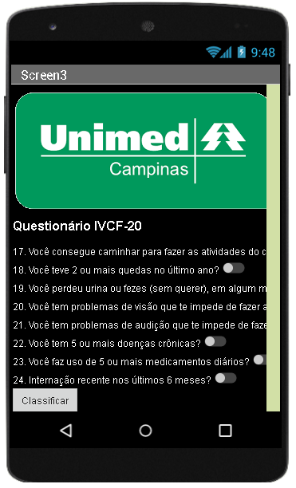

# Aplicativo cuIdaDOSO
O aplicativo cuIdaDOSO para Android foi projetado com duas funcionalidades para:
1. [Detectar os pacientes hiper consultadores](src/jaltsHiperConsultador.apk)
2. [Classificar a fragilidade do idoso](src/jaltsClassificaPaciente.apk)

## Código-fonte
Os códigos do aplicativo estão disponíveis na pasta [src](src/).

## Figuras
1. Hiper consultador

  

2. Classifica Paciente

  
